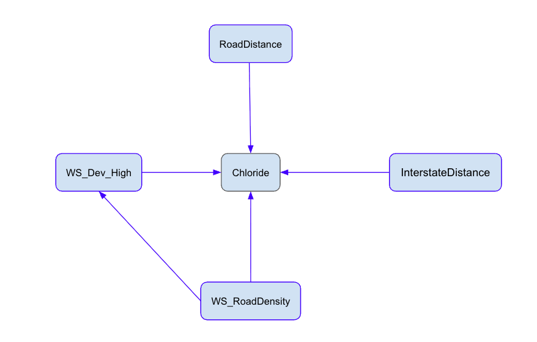

# Identifying drivers of lake contamination by chloride in the Midwest and Northeast United States

## Purpose

The purpose of this project is to identify different drivers of lake contamination by anthropogenic chloride in Midwest and Northeast United States. Its important to identify drivers of chloride contamination because of its negative effects on ecosystems and drinking water quality. By seeing what variables have a positive effect on chloride concentrations, we can better identify lakes at risk.

Human activity has a big influence on chloride pollution in lakes. Chloride can be introduced into lakes via road salts, sewage leaks, industrial waste, and septic systems. The reason the Midwest and Northeast United States was chosen as the study area was due to its use of road salts. This region experiences lots of snow every year, so they utilize lots of road salts to keep ice off their roads. Unfortunately, this causes road salt run off to enter near by water bodies causing spikes in chloride concentration.

When concentrations of chloride are high in freshwater ecosystems this causes physiological stress in many aquatic organisms such as fish, amphibians, and macroinvertebrates. Chloride disrupts their ability to regulate ions and maintain proper water balance. Chloride also increase water density, stratification, and reduces natural mixing causing lower oxygen levels in deeper waters. This can lead to reduced growth, reproduction problems, or death in sensitive species. The extent of chloride's effect doesn't stop their. Plants are also at risk because chloride causes leaf burn, which reduces photosynthesis. Reductions in photosynthesis will result in reduced plant growth, reduced oxygen in the water, and reduced food availability for fish and invertebrates.

## Data

```{r}
# Load in libraries
suppressPackageStartupMessages({
library(here)
library(tidyverse)
library(dplyr)
library(broom)
library(knitr)
library(kableExtra)})
```

```{r}
# Read in data
df <- suppressMessages(read_csv(here('data', 'edi.452.2', "lakeCL_trainingData.csv")))
```

The data I'm using has chloride concentrations for 2,773 lakes in the Midwest and Northeast United States. This data was collected from 1990-01-01 to 2018-12-13 and contains data about the lake's watershed characteristics, dimensions, and its proximity to roads. When the chloride concentrations are plotted on a histogram its clear the data is positive. Since chloride is a continuous and strictly positive variable I decided to model it with a GLM with Gamma family and log link.

```{r}
# Make a histogram showing the data distribution of Chloride
df |>
  ggplot(aes(x = Chloride)) +
  geom_histogram(bins = 50, fill = "lightblue", color = "blue") +
  labs(title = "Chloride Concentation in lakes",
       x = "Chloride",
       y = "Count") +
  theme_minimal()
```

For this analysis, I chose `WS_RoadDensity` as my main predictor variable of interest, and `WS_Dev_High`, `RoadDistance`, and `InterstateDistance` as confounding variables. I chose these 3 confounding variables because they show some correlation with chloride, as shows below in the correlation matrix.

```{r}
# Visualize how correlated Chloride is with WS_Dev_High, RoadDistance, and InterstateDistance
cor(df[, c("Chloride", "WS_Dev_High", "RoadDistance", "InterstateDistance")], use = "complete.obs")
```

### Study Question:

-   Does the road density in a watershed impact chloride concentrations in lakes?

| Column | Meaning |
|------------------------------------|------------------------------------|
| `WS_Dev_High` | \% landuse classified as developed, high intensity in the watershed |
| `WS_RoadDensity` | Road density in the watershed |
| `InterstateDistance` | Distance to the nearest interstate |
| `RoadDistance` | Distance to the nearest road |
| `Chloride` | Concentration of chloride in lake |

{fig-align="center" width="60%"}

## Data Cleaning

This data frame has multiple observations for the same lake. To resolve this I selected all rows with the same unique lake identifier(nhdid) and only kept the most recent observation.

```{r}
# For lakes with multiple observations, only keep the most recent record
df <- df %>%
  group_by(nhdid) %>%
  slice_max(ActivityStartDate, n = 1, with_ties = FALSE) %>%
  ungroup()

```

## Create the Model

The model below is a GLM with Gamma family and log link. In this model Chloride is the response variable and WS_RoadDensity is the predictor variable.

### Statistical Notation

$$ 
\begin{align}
Chloride &\sim \text{Gamma}(\mu, \phi) \\
\log(\mu) &= \beta_0 + \beta_1 \,\text{WSRoadDensity} + \beta_2 \,\text{WSDevHigh} + \beta_3 \,\text{RoadDistance} \\&\quad + \beta_4 \,\text{InterstateDistance} \end{align} 
$$

### Hypothesis

$$
\begin{align}
H_0 &: \beta_1 = 0 \\
H_A &: \beta_1 != 0
\end{align}
$$

```{r}
# Make a Gamma model with Chloride as response and WS_RoadDensity as the predictor
model_cl <- glm( Chloride ~ WS_RoadDensity 
    # Confounding variables
    + WS_Dev_High + RoadDistance + InterstateDistance,
    
  family = Gamma(link = "log"),
  data = df
)
```

## Model Output

```{r}
# Select and round model outputs to include in kable
model_table <- tidy(model_cl) |> # Turn model_cl into a tidy tibble
  mutate(
    estimate = round(estimate, 4),
    std.error = round(std.error, 4),
    statistic = round(statistic, 2),
    p.value = round(p.value, 8)
  )

# Create kable with model_cl outputs
k1 <- kable(model_table, format = "html", caption = "Gamma GLM Results") |>
  kable_styling(full_width = TRUE, bootstrap_options = c("striped")) 

# Print the kable
k1

```

```{r}
# Assign rows used in the  model_cl model to df_model
df_model <- model_cl$model

# Create a grid for plotting WS_RoadDensity and Chloride
pred_line <- tibble(
  WS_RoadDensity = seq(min(df_model$WS_RoadDensity, na.rm = TRUE),
                    max(df_model$WS_RoadDensity, na.rm = TRUE),
                    length.out = 1000),
  # Find the mean of all confounding variables to hold them constant
  WS_Dev_High = mean(df_model$WS_Dev_High, na.rm = TRUE),
  RoadDistance = mean(df_model$RoadDistance, na.rm = TRUE),
  InterstateDistance = mean(df_model$InterstateDistance, na.rm = TRUE)
)

```

```{r}
# Create predictions for pred_line
preds <- predict(
  model_cl,
  newdata = pred_line,
  type = "link",
  se.fit = TRUE
)

# Convert link (log scale) to response scale
pred_line <- pred_line |>
  mutate(
    fit_link = preds$fit,
    se_link = preds$se.fit,
    fit = exp(fit_link),
    lower = exp(fit_link - 1.96 * se_link),
    upper = exp(fit_link + 1.96 * se_link)
  )

```

## Data Visualization

```{r}
# Plot data points, predicted mean curve, and 95% confidence interval
ggplot() +
  geom_point(data = df_model, aes(x = WS_RoadDensity, y = Chloride),
             color = "dodgerblue", alpha = .67) + # Data points
  geom_ribbon(data = pred_line, aes(x = WS_RoadDensity, ymin = lower, ymax = upper),
              alpha = 0.25, fill = "lightblue") + # Confidence interval
  geom_line(data = pred_line, aes(x = WS_RoadDensity, y = fit),
            color = "black", linewidth = 1) + # Predicted mean curve
  labs(
    title = "Effect Road Density in Watershed on Lake Chloride",
    x = "Road Density in Watershed",
    y = "Chloride (mg/L)"
  ) +
  theme_minimal()

```

## Restating Hypothesis

-   Null hypothesis (H₀): Road density in a watershed has no effect on chloride concentrations in lakes (β₁ = 0).

-   Alternative hypothesis (Hₐ): Road density has an effect on chloride concentrations in lakes (β₁ ≠ 0).

Due to the fact that the p-vlaue of of `WS_RoadDensity` is much smaller than 0.05, my data rejects the null hypothesis. This means that road density in a watershed is strongly associated with chloride concentrations in lakes. According to my model for each 1-unit increase in `WS_RoadDensity` the expected chloride concentration increases by exp(0.0172). This is likely caused by the fact that road salts are used to defrost roads since this is a snowy region of America.

## Simulate Data

The code chunk below uses the model_cl model to simulate data to be used in our model predictions. This data is simulated with new chloride concentration values by using fitted Gamma GLM. This is done to see if the model has reasonable assumptions. New values are simulated using the model’s estimated mean and standard deviation.

The Gamma GLM assumes that:

-   chloride is continuous and positive

-   variance increases as the mean increases

-   effects of predictor variables are multiplicative

```{r}
# Calculate the means and SDs for each predictor
mean_WS_RoadDensity <- mean(df_model$WS_RoadDensity, na.rm = TRUE)
sd_WS_RoadDensity   <- sd(df_model$WS_RoadDensity, na.rm = TRUE)

mean_WS_Dev_High <- mean(df_model$WS_Dev_High, na.rm = TRUE)
sd_WS_Dev_High   <- sd(df_model$WS_Dev_High, na.rm = TRUE)

mean_RoadDistance <- mean(df_model$RoadDistance, na.rm = TRUE)
sd_RoadDistance   <- sd(df_model$RoadDistance, na.rm = TRUE)

mean_InterstateDistance <- mean(df_model$InterstateDistance, na.rm = TRUE)
sd_InterstateDistance   <- sd(df_model$InterstateDistance, na.rm = TRUE)
```

```{r}
# Set seed
set.seed(67)

# Choose the sample size
n <- 10000

# Extract coefficients from model_cl
betas <- coef(model_cl)

# Assign coefficients for each variable
beta0 <- betas["(Intercept)"]
beta1 <- betas["WS_RoadDensity"]
beta2 <- betas["WS_Dev_High"] 
beta3 <- betas["RoadDistance"]
beta4 <- betas["InterstateDistance"]

# Set the Gamma shape parameter
phi <- 3

# Simulate each of the predictors
WS_RoadDensity <- rnorm(n, mean = mean_WS_RoadDensity, sd = sd_WS_RoadDensity)
WS_Dev_High <- rnorm(n, mean = mean_WS_Dev_High, sd = sd_WS_Dev_High)
RoadDistance <- rnorm(n, mean = mean_RoadDistance, sd = sd_RoadDistance)
InterstateDistance <- rnorm(n, mean = mean_InterstateDistance, sd = sd_InterstateDistance)

# Replace simulated negative values with 0s, since the gamma doesn't accept them
WS_RoadDensity[WS_RoadDensity < 0] <- 0
WS_Dev_High[WS_Dev_High < 0] <- 0
RoadDistance[RoadDistance < 0] <- 0
InterstateDistance[InterstateDistance < 0] <- 0

# Compute the linear predictor
log_mu <- beta0 +
  beta1 * WS_RoadDensity +
  beta2 * WS_Dev_High +
  beta3 * RoadDistance +
  beta4 * InterstateDistance

# Convert the linear predictor to mean
mu <- exp(log_mu)

# Simulate chloride values
Chloride <- rgamma(n, shape = phi, scale = mu / phi)

# Put predicted vairables into a dataframe
sim_df <- data.frame(Chloride, WS_RoadDensity, WS_Dev_High, RoadDistance, InterstateDistance)

# Fit your Gamma GLM
sim_model <- glm(
  Chloride ~ WS_RoadDensity
    # Confounding variables
    + WS_Dev_High + RoadDistance + InterstateDistance,
  
  family = Gamma(link = "log"),
  data = sim_df
)

# Select and round model outputs to include in kable
model_table <- tidy(sim_model) |> # Turn sim_model into a tidy tibble
  mutate(
    estimate = round(estimate, 4),
    std.error = round(std.error, 4),
    statistic = round(statistic, 2),
    p.value = round(p.value, 8)
  )

# Create kable with sim_model outputs
k2 <- kable(model_table, format = "html", caption = "Simulated Gamma GLM Results") |>
  kable_styling(full_width = TRUE, bootstrap_options = c("striped")) 

# Print the kable
k2

```

## Check the real data model estimates against the simulation model estimates

```{r}
# Print real data model estimates
k1
```

```{r}
# Print simulated data model estimates
k2
```

After applying the model to the simulated dataset, constructed based on the assumptions of model_cl, the estimated parameters closely matched the true values. This demonstrates that the simulated data recovered the original model parameters. Even with simulated data, the p-value for WS_RoadDensity is much smaller than 0.05, indicating that we can reject the null hypothesis.

